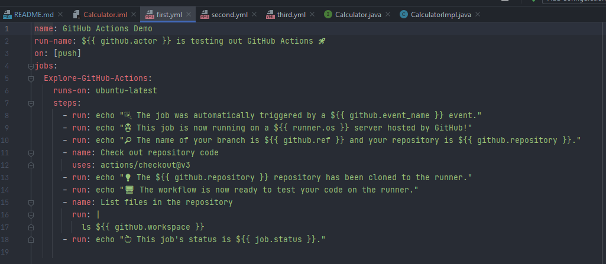
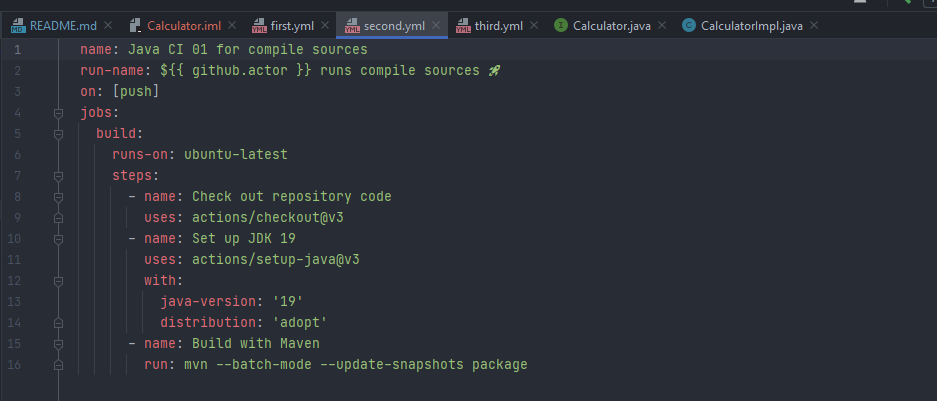
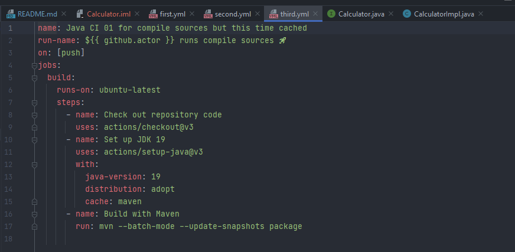

# Calculator Example 1.2 

Upgraded, tested and cleaned for Continuous Delivery Pipeline testing

## Installation

no special installation needed, currently upgraded Tools Version for 1.2
- Maven 3.8.6
- JDK 19.0.1

```bash
mvn clean
```

## Usage

```bash
mvn test
```

## Contributing

Pull requests are welcome. For major changes, please open an issue first
to discuss what you would like to change.

Please make sure to update tests as appropriate.

## License

[GNU GPLv3](https://choosealicense.com/licenses/gpl-3.0/)

# Dokumenation 
**Überlegen Sie sich, wie Sie die einzelnen Schritte (compile und test) separat als
steps abbilden können. Wäre das vorteilhaft? Begründen Sie Ihre Antwort.**

Trennen der Schritte von Kompilieren und Testen in separate Schritte in einem GitHub Actions Workflow kann vorteilhaft sein.

**Isolation**: Durch das Trennen der Schritte erhält man eine größere Kontrolle und Isolation jedes 
einzelnen Schrittes, was nützlich sein kann beim Debugging und Fehlersuche.

**Wiederverwendbarkeit**: Durch das Trennen der Schritte in separate Aktionen erhält man mehr Flexibilität 
und Wiederverwendbarkeit des Workflows.

**Parallelisierung**: Durch das Trennen der Schritte in separate Aktionen ist es möglich die Schritte zu parallelisieren, 
was die Gesamtleistung des Workflows verbessert.

**Einfachere Wartung:** Wenn die Schritte getrennt sind, ist es einfacher, sie zu aktualisieren oder zu modifizieren, ohne die anderen Schritte zu beeinflussen.

Es ist jedoch zu beachten, dass das Trennen der Schritte die Komplexität des Workflows erhöhen kann, was es schwieriger macht, es zu 
verstehen und zu warten. Es ist auch möglich, ähnliche Vorteile durch die Verwendung von verschiedenen Jobs im gleichen Workflow zu erzielen. 
Letztendlich hängt es von den spezifischen Anforderungen des Projekts und des Teams ab, ob das Trennen der Schritte in separate Schritte vorteilhaft ist.

#Screenshots
First yml file only a demo which gives some outputs and and checkous the repo to the runner 



Second triggered by push  builds maven package


Third yml triggered by push builds maven package and caches it result is much faster
